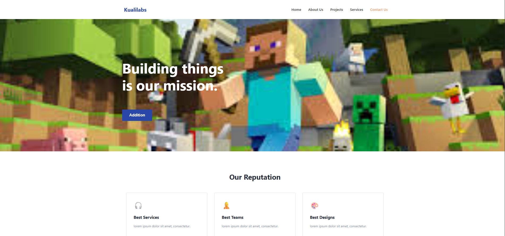

# Landing Page

Este proyecto consiste en la maquetación e implementación de una Landing Page moderna basada en el diseño "TheBox". Fue desarrollado utilizando **React** con **TypeScript** y **Vite**, enfocándose en buenas prácticas de arquitectura de componentes y código limpio.

## Descripción del Proyecto
El objetivo principal fue transformar un diseño estático en una aplicación web reactiva, asegurando una estructura escalable.

## Estructura HTML
Se priorizó el uso de **HTML5** para mejorar la accesibilidad y la estructura del documento, evitando el uso excesivo de `
` genéricos.

* **`<header>`**: Contenedor principal de la navegación y el logotipo.
* **`<nav>`**: Define los enlaces de navegación principales.
* **`<main>`**: Envuelve el contenido principal de la página (Hero y Reputación).
* **`<section>`**: Delimita áreas temáticas grandes (como la sección Hero).
* **`<article>`**: Utilizado para las "Cards" de reputación, ya que representan contenido independiente y reutilizable.

## Convención CSS (BEM)
Para los estilos se implementó la metodología **BEM (Block Element Modifier)**. Esto permite mantener un CSS modular y fácil de mantener, evitando conflictos de especificidad.

* **Bloque**: El componente padre (ej. `.card`).
* **Elemento**: Una parte interna del bloque (ej. `.card__title`).
* **Modificador**: Una variante del estilo (ej. `.button--primary`).

## Interactividad (JavaScript/TypeScript)
La lógica del proyecto se maneja mediante componentes funcionales de React.
* **Addition**: Se implementó una función disparada por un evento `onClick`. Esta función utiliza `Math.random()` para generar dos números enteros aleatorios (1-100), los presenta al usuario mediante un `alert`, y posteriormente calcula y muestra la suma total.

## Resultado Final

---
Desarrollado por: **Cristian Morales Cobián**